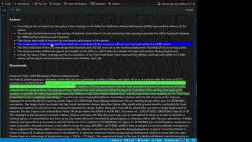

# Local RAG Question Answering Notebook

This project offers a lightweight implementation for question-answering on PDF documents using local hardware. It leverages llama.cpp Python bindings for CPU support and showcases a demo in a Jupyter Notebook. Key features include:

A preprocessing and chunking pipeline for PDF documents
PDF extraction implemented with AllenAI's Papermage (https://github.com/allenai/papermage) 
A visualization plugin to compare generated responses with source documents, enabling model answer verification

The implementation demonstrates how to perform document-based question-answering without relying on cloud services, making it suitable for scenarios requiring data privacy or offline processing.

## Requirements

- At least 10GB of random access memory (RAM) available for CPU inference
- (Nvidia GPU recommended for faster inference with at least 18GB VRAM)
- Python 3.11 

## Installation

Clone the repository:

```sh
git clone https://github.com/strath-ace-labs/local_rag

cd local_rag
```

Install the required Python packages into new environment:

```sh
pip install -r requirements.txt
```

## Setup

- Insert your documents into a "./datasets/<your_dataset>/"
- Run a script similar to "preprocess_nasa_teaching_documents.sh" preprocess PDFs and chunk texts accordingly

## Running QA 

- open "qa_notebook.ipynb" and follow instructions there

### Load different LLM Models

- **Device Selection**: Specify `device` as either 'cpu', 'cuda' (for GPU), or `None` for self-selection.
- **Model Specification**: 
  - To specify a specific model, use the link to the Hugging Face repository:
    - Example for CPU model: 
      ```
      model = rag_llm_classes.load_inference_model(model_name='QuantFactory/Meta-Llama-3.1-8B-Instruct-GGUF', file name="Meta-Llama-3.1-8B-Instruct.Q5_K_M.gguf", device='cpu')
      ```
    - Example for GPU model:
      ```
      model = rag_llm_classes.load_inference_model(model_name='Nexusflow/Starling-LM-7B-beta', device='cuda')
      ```
  - Check for new models at [LMSYS Arena](https://arena.lmsys.org/).
  - **Add Tokenizer** Change tokenizer_dict variable in in rag_llm_classes.load_cpu_model to include the tokenizer to your model (fallback llama3 tokenizer)
  - **Default Model**: If not specified, the standard model loaded is Llama-3.
  - **License Agreement**: Note that some models may require a license agreement before use.

## Features 

### 1. Input field in qa_notebook.ipynb:


### 2. Visualisation of relevance of document chunks to generated answer


