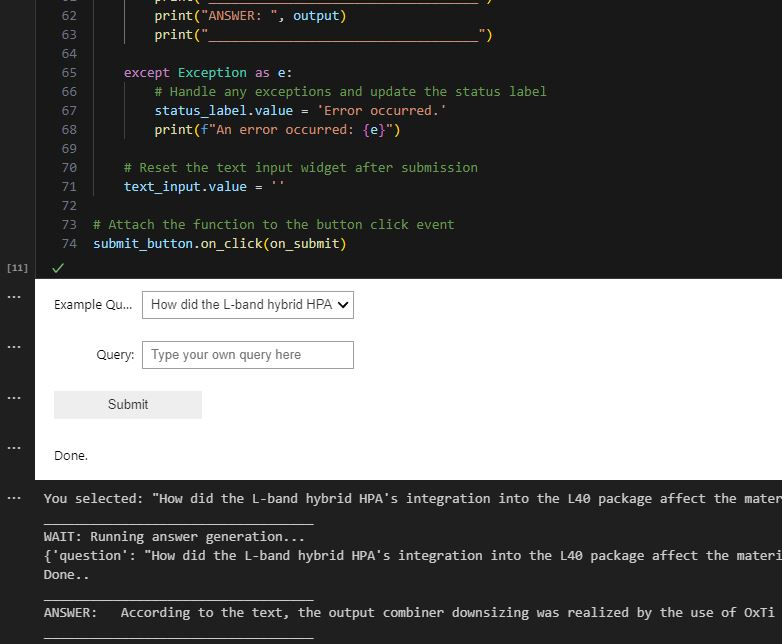
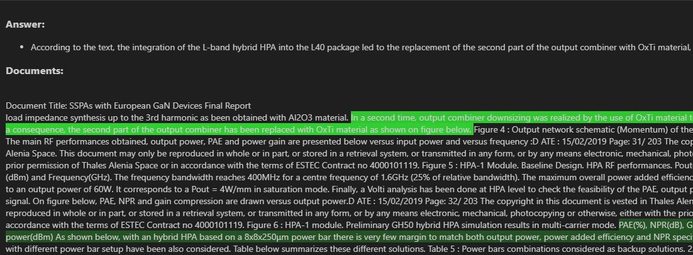

# ESA Document QA 

This project provides tools for question-answering on ESA final report documents.

## Requirements

- Linux OS
- At least 8GB of random access memory (RAM) available (GPU recommended)
- Python 3.11 installation


## Installation

Clone the repository:

```sh
git clone https://github.com/PaulDrm/satnex_document_qa
cd satnex_document_qa
```

Install the required Python packages into new environment:

```sh
pip install -r requirements.txt
```

## Setup

- Insert ESA final report documents in folder "./datasets/esa_documents/"
- Run "preprocess_esa_documents.sh" 

## Running QA 

- open "qa_notebook.ipynb" and follow instructions there

## Features 

### 1. Input field in qa_notebook.ipynb:



### 2. Visualisation of relevance of document chunks to generated answer


